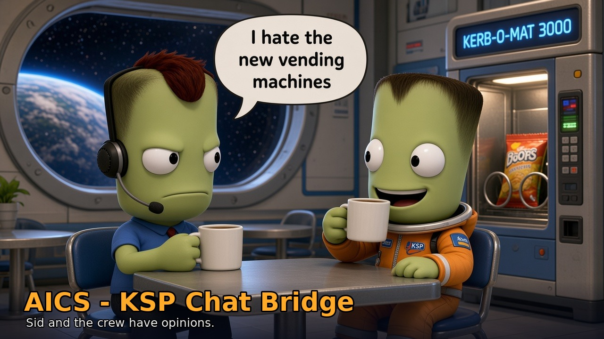

# AICS - KSP Chat Bridge

*Repository, CKAN identifier and DLL name: KSPChatBridge.*

**New here? Start with the [wiki](https://github.com/zernon916/KSPChatBridge/wiki)**: installation, a five-minute quick start,
every command, the autopilots, the crew, and troubleshooting.

## Optional mods (work if installed)

Nothing here is required; each is detected at runtime (no hard dependency):

- **SCANsat**: the AICS map reveals terrain from SCANsat coverage instead of only your flight path.
- **MechJeb2**: orbital tools (transfers, plane matching, course corrections) use MechJeb's planners.
- **RasterPropMonitor** (FirstPersonKSP, KSP 1.12): adds **AICS ILS** and **AICS MAP** pages to IVA MFDs (needle bars, coupling, IAS band, callouts; ASCII map with runway, route and join point).
- **JSI Advanced Transparent Pods** (JPLRepo, KSP 1.12): see-through cockpit windows/IVAs from the outside view. Works alongside RasterPropMonitor; nothing in AICS depends on it.

## Found a bug?

Report it at **https://github.com/zernon916/KSPChatBridge/issues** and attach:

- `KSP.log` (in the Kerbal Space Program folder)
- the `GameData/KSPChatBridge/PluginData/logs` folder
- which craft you were flying and what you did (the chat message / button, and what happened vs. what you expected)

## How it works
Everything runs inside KSP: one plugin DLL (`GameData/KSPChatBridge/Plugins/KSPChatBridge.dll`), no external
programs, no kRPC. The in-mod AI host sends your chat to the AI you picked (a cloud API, LM Studio / Ollama on this
PC, or the embedded Qwen model) and runs the tools it calls on the in-mod flight controller: autopilots, takeoff,
approach charts + coupled ILS autoland, taxi, flight plans, crew chatter, science watcher, systems dashboard.
Clear commands ("take off", "land runway 27") skip the model entirely. With **AI off** (AICS > Settings) the
menus and autopilots still work locally.

## Requirements
- KSP 1.12.x. Nothing else is required; see *Optional mods* above.
- An AI for chat: a free cloud key (Gemini, Groq, OpenRouter), an OpenAI-compatible API, LM Studio / Ollama, or the
  embedded Qwen model (AICS > Settings > In-mod AI downloads the runtime and model on request).

## Install
1. **Via CKAN** (once listed): search for *KSP Chat Bridge* (`KSPChatBridge`).
   **Manual**: unzip `KSPChatBridge-<version>.zip` from the GitHub releases into the KSP folder so you get
   `GameData/KSPChatBridge/Plugins/KSPChatBridge.dll`.
2. Start KSP and load a save. Open the chat with Alt+K (or the toolbar button) and the AICS menu with Alt+J.

Your data (`.env` with API keys, `native_settings.json`, `aics.cfg`, charts, `kerbal_personalities.json`,
`playstyle_notes.md`, `logs/`) lives in `GameData/KSPChatBridge/PluginData/`, which updates and CKAN leave alone.
Upgrading from a bridge build (0.1.x): the old `Bridge/` folder and `bridge.cfg` are no longer used and can be deleted;
`ai_enabled` and the science setting carry over.

## Backends and models
| Settings dropdown | id (`/ai <id>`) | Needs | Default model |
|---|---|---|---|
| LM Studio | `local` | LM Studio server on :1234 | the loaded model |
| Ollama | `ollama` | `ollama serve` on :11434 | `OLLAMA_MODEL` or the first installed model |
| ChatGPT | `chatgpt` | `OPENAI_API_KEY` | `OPENAI_MODEL` (default `gpt-4.1-mini`) |
| Gemini | `gemini` | `GEMINI_API_KEY`, free key at aistudio.google.com | `GEMINI_MODEL` (default `gemini-flash-latest`) |
| Groq | `groq` | `GROQ_API_KEY`, free key at console.groq.com | `GROQ_MODEL` (default `openai/gpt-oss-120b`) |
| OpenRouter | `openrouter` | `OPENROUTER_API_KEY`, free key at openrouter.ai | `OPENROUTER_MODEL` (default `openrouter/free`) |
| Hugging Face | `huggingface` (`/ai hf`) | `HF_TOKEN` with "Inference Providers" permission | `HF_MODEL` |
| Custom (OpenAI-compatible) | `custom` | `CUSTOM_AI_URL` + `CUSTOM_AI_MODEL` (+ `CUSTOM_AI_KEY`) | `CUSTOM_AI_MODEL` |
| Claude | `claude` | `ANTHROPIC_API_KEY` | `CLAUDE_MODEL` |
| Grok | `grokbot` | `XAI_API_KEY` (or `GROK_API_KEY`) | `XAI_MODEL` |
| Cline | `cline` | `CLINE_API_KEY` | `CLINE_MODEL` (default `minimax/minimax-m2.5`, free) |
| Embedded Qwen (in-mod) | `embedded` | nothing (downloads on request) | bundled Qwen GGUF |

**Enter keys in game:** AICS > Settings > pick the backend > paste the key in the **API key** field > **Save**.
It is written to `PluginData/.env` and used immediately; it is only ever shown masked. **Clear key** (click twice)
removes it. Editing `.env` by hand (`GEMINI_API_KEY=...`, one per line) also works.
### Free cloud AIs (no GPU needed)
All optional: no key = that entry just says which key to add. Get a free key, paste it in AICS > Settings.
Limits as published around 2026-10 (they change often; free tiers may also use your prompts for training):
| Backend | Free limit | What it means here |
|---|---|---|
| Gemini (AI Studio key) | per-model RPM / requests-per-day caps (Flash models are the generous ones; Pro is tight) | fine for casual play; see ai.google.dev/gemini-api/docs/rate-limits |
| Groq | 30 req/min, 1,000 req/day, **8K tokens/min**, 200K tokens/day (gpt-oss-120b/20b, qwen3.8-27b) | each request carries ~5K tokens of tools + system prompt, so a tool step can hit the per-minute cap; AICS waits `Retry-After` (<= 30 s, `CLOUD_RETRY_MAX_WAIT`) and retries twice. ~40 messages/day |
| OpenRouter `:free` | 20 req/min, **50 req/day** (1,000/day after a one-time $10 credit purchase) | one chat message = 1-4 requests -> ~15-25 messages/day |
| Hugging Face router | free accounts get little or no monthly credit (HF's own docs disagree: $0.10 vs none) | effectively pay-as-you-go; included for completeness |
Rate-limited replies say so ("rate limit hit ... switch AI in AICS > Settings"); bad keys say "rejected the API key".

Custom examples: `https://api.mistral.ai/v1`, DeepSeek `https://api.deepseek.com/v1`, xAI `https://api.x.ai/v1`,
Anthropic `https://api.anthropic.com/v1` (OpenAI SDK compatibility), any local vLLM / llama.cpp server. The model must
support OpenAI-style tool calls or it can only chat, not fly.
Chat commands: `/ai <id>` switches backend, `/model` lists / switches the backend's models, `/crew chatter on|off`,
`@Name ...` talks to a crew member.

## In-game window
Alt+K or the stock toolbar speech-bubble button. Fixed-size window (drag the title to move, drag the
`//` grip upper-right (grows up/right) or bottom-right to resize, min 300x200); history scrolls and jumps to the
newest message; multi-line input (word wrap; Enter sends, Shift+Enter = new line) that grows downward up to ~5
lines, then scrolls. No backend buttons on the window any more (title shows backend / model); switch in
AICS -> Settings or with `/ai <id>`. Position, size and selected backend (by id) are saved to
`GameData\KSPChatBridge\PluginData\window.txt`. "Clear" wipes the window and the chat history.
While a landing is in progress (land_here / land_at / land_at_ksc / land_plane / land_at_spot, or a parachute
descent) a live line under the history shows the estimated distance and time to touchdown.

**Landing menu** ("Land" button next to Send): mode **V** (vertical, rockets) or **H** (horizontal, planes:
runways only). Pick a spot from the list (built-ins: KSC Pad, Runway 09, Runway 27, Island Airfield; plus your
own) and press *Land at spot*; *Land at KSP target* lands next to whatever is targeted on the map (vessel,
flag, rover/probe "beacon"; a station in orbit triggers rendezvous + docking instead); *Mark current position*
saves where you are (H mode: a runway starting here in your current heading, ~1 km long); or type lat/lon
(+ landing heading for H) and save. *ETA* and *Abort* buttons. Results appear in chat as `Landing: ...`.
The AI does the same by chat: "land at Island Airfield", "save this spot as Mun base", "land next to my flag".

## Approach charts, ILS and the map
AICS > Approach & Autoland flies a published-style approach to KSC 09/27 or the Island runway: join on the chart's
line, stabilized speed schedule (deceleration measured per craft), coupled localizer + glideslope on the true runway
centerline, flare, rollout, taxi. Charts are per-runway-end JSON files in `PluginData/charts/` (`KSC_09.json`,
`KSC_09_tight.json`, ...), hot-reloaded when they change; edit them in the in-game **Map & Charts** window or the HTML
editor (`python tools/approach_map.py`). The window's ILS tab shows deviations, status and hand-flying guidance.

## Science watcher
The in-mod watcher notices new science situations, biomes and SOIs. **remind** (default) posts a notice and runs +
transmits rerunnable experiments; **auto** runs everything available; **off** does nothing. Switch by chat
("science auto on" / "science watcher off").

## Playstyle memory and logs
- `PluginData/playstyle_notes.md`: one `- ` bullet per preference, injected into every system prompt; the AI adds
  notes when you ask it to remember something. Edit by hand any time.
- `PluginData/logs/`: chat and flight logs (attach them to bug reports).

## Building and tests
`cd KSPChatMod && dotnet build -c Release` (needs only the .NET SDK; .NET Framework 4.7.2 reference assemblies come
from NuGet). A Release build copies `KSPChatBridge.dll` to `GameData\KSPChatBridge\Plugins\` (add
`-p:SkipInstall=true` to build without installing; `-p:KSPDir=...` if KSP is elsewhere).
Tests: `dotnet run --project tests/csharp/Aics.Tests.csproj` (offline behavior checks, no KSP needed).
Release zip: `powershell -File tools\package_release.ps1` writes `dist/KSPChatBridge-<version>.zip` + SHA-256 sums.
The CKAN metadata draft is `ckan/KSPChatBridge.netkan`.

## License
MIT - see [LICENSE](LICENSE). Copyright (c) 2026 Luke Benko (zernon916). MechJeb2, SCANsat, RasterPropMonitor and
JSI Advanced Transparent Pods are separate mods under their own licenses and are not included.